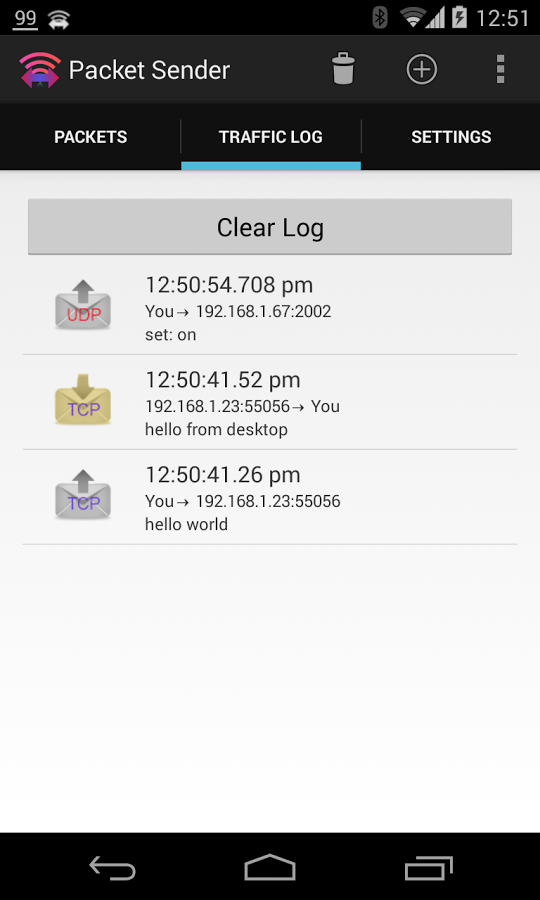

*This repo has been abandoned.* The mobile edition is now a Xamarin project that exists here:
https://github.com/dannagle/Packet_Sender_Mobile

# Packet Sender for Android
This was the native Android version of Packet Sender for Desktop. The project is not being actively developed.

## Parent project
This was originally an attempt to rewrite the GPL-based desktop version:
https://github.com/dannagle/PacketSender

## License

MIT. Feel free to fork and make it your own.

## Copyright

Packet Sender is wholly owned and copyright &copy;  -  [@NagleCode](http://twitter.com/NagleCode) - [DanNagle.com](http://DanNagle.com)  -  [PacketSender.com](http://PacketSender.com)
